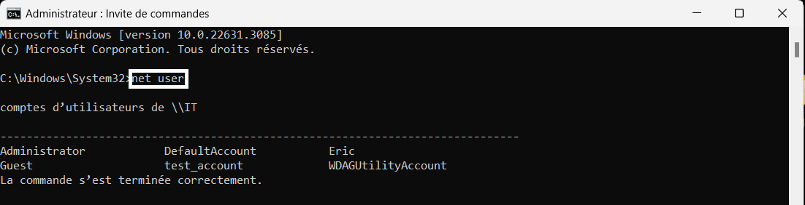
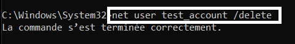
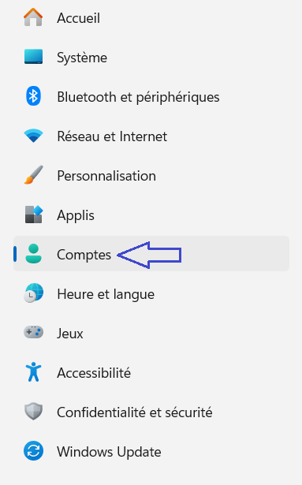
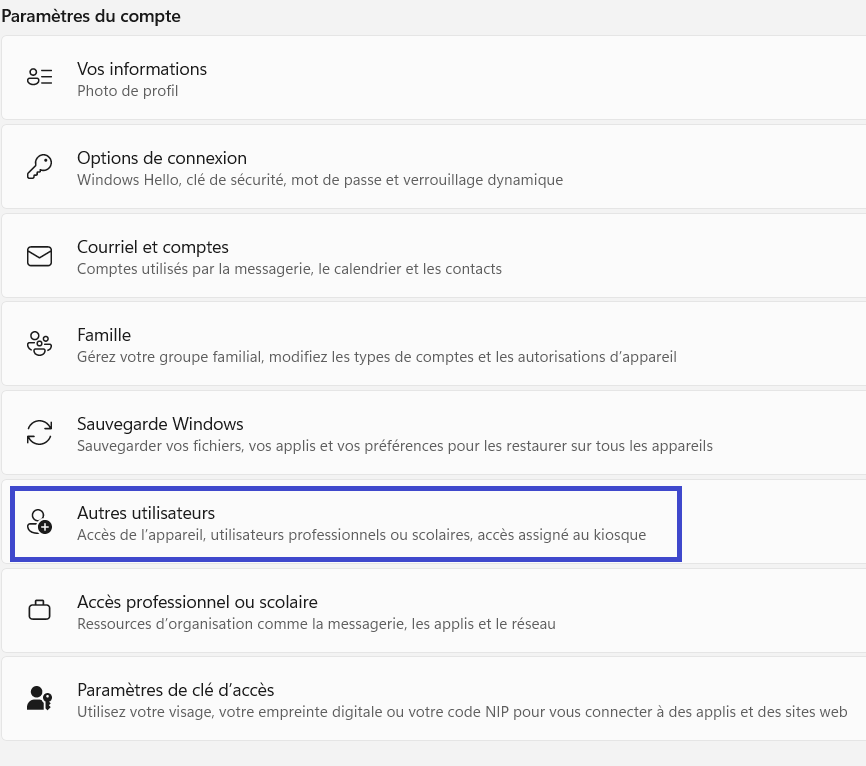
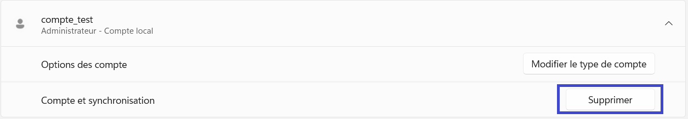
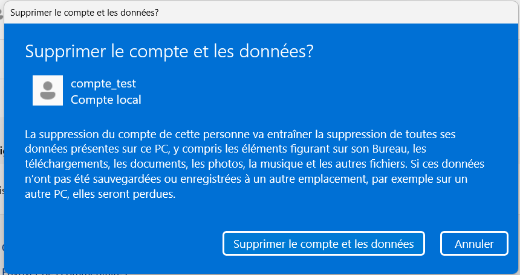
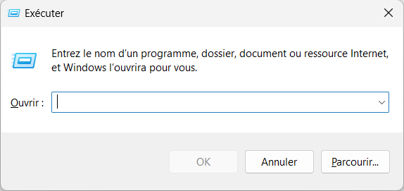
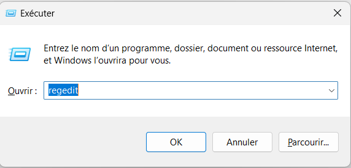
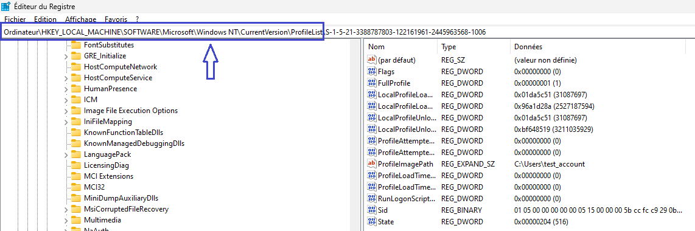
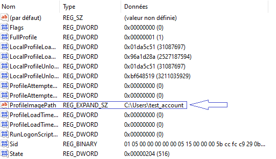

import Tabs from '@theme/Tabs';
import TabItem from '@theme/TabItem';

# Suppression d'un utilisateur

La gestion des utilisateurs est essentielle pour maintenir la sécurité et l’efficacité d'un système d’exploitation Windows. Que vous souhaitiez retirer un compte inactif ou simplement nettoyer votre liste d’utilisateurs, la suppression d’un compte utilisateur est une tâche courante.

Dans cette documentation, je vous exposerai les étapes nécessaires pour supprimer un utilisateur sur Windows 10 et Windows 11. J'aborderai les méthodes via l’interface graphique et en ligne de commande, ainsi que les considérations importantes à prendre en compte lors de la suppression d’un compte.

<Tabs>
  <TabItem value="windows10" label="Windows10" default>

    ## Interface Utilisateur Windows 10

    ## Invite de commandes Windows 10

  1. On peut aussi utiliser l'invite de commandes pour supprimer un utilisateur sans passer par les menus offerts dans Windows.

  2. Pour ouvrir l'invite, il suffit cliquer sur le logo Windows et écrire __cmd__ pour accéder à l'invite de commandes. Il faut par contre l'ouvrir en mode __administrateur__.

  3. On peut entrer la commande __net user__ pour voir les utilisateurs dans l'ordinateur.

  

  :::warning

  Les comptes sont inscrits dans un __tableau__, sur l'image, il y a 6 comptes utilisateurs. Windows se crée des sessions qu'il est préférable de ne pas toucher pour assurer le bon fonctionnement de l'ordinateur.

  :::

    4. Ensuite, la prochaine commande à entrer est __net user nomDuCompte /delete__ pour supprimer l'utilisateur.

    

    5. Il faut quand même aller dans les clés de registre pour finaliser la suppression complètement. Voir étapes 6 à 10 plus haut.

  </TabItem>
  <TabItem value="windows11" label="Windows11">

  ## Interface Utilisateur Windows 11
 La procédure pour Windows 11 est sensiblement la même, seul quelques menus ne sont pas identiques. Voici la procédure.

  1. La première étape de la suppression d'un utilisateur est d'accéder à la fenêtre des paramètres. Il suffit d'appuyer sur le bouton __avec le logo Windows__ et d'écrire __Paramètres__ pour y accéder.

  2. Ensuite, dans la liste de gauche, il suffit d'aller cliquer l'icône __Comptes__.

  

  3. Ici, dans la section __Paramètres du compte__, il faut naviguer jusqu'à la section __Autres utilisateurs__.

  

  4. Dans cette fenêtre, vous pourrez voir tous les comptes listés présents sur l'ordinateur, autre que le compte sur lequel vous êtes connectés présentement.

  5. Si on clique sur __Supprimer__, un avertissement de Windows s'affichera à l'écran.

  

  :::info

  En cliquant sur le compte à supprimer, deux options s'offrent à l'utilisateur. Modifier le type de compte permet de décider si l'utilisateur à un compte __normal__ ou __administrateur__, ce qui ne nous intéresse pas dans cet article. La seconde option est celle de supprimer.

  :::

  

  :::warning

   Il faut s'assurer d'avoir sauvegardé nos documents nécessaires sur le compte utilisateur à supprimer. La procédure est irréversible!!.

  :::

  6. Il reste quelques étapes après la suppression pour s'assurer que l'utilisateur et ses fichiers et données soit supprimées de l'appareil par souci de sécurité. Windows se crée des fichiers que l'utilisateur ne voit pas forcément et des clés de registre qu'il faut aussi supprimer. La première étape est d'entrer les commandes __Windows + R__.

  

  7. Pour accéder aux clés de registre il suffit d'entrer __regedit__ comme dans l'image.

  

  8. Dans le menu qui apparait suite à la commande, il faut naviguer dans le dossier indiqué dans la prochaine image juste dans le dossier __ProfileList__ pour voir les profiles utilisateurs de l'ordinateur.

  

  :::danger

  Jouer dans les clés de registre peut entrainer des dégats non réparables à un ordinateur (perte de données!!), veuillez suivre les prochaines étapes sans fautes!

  :::

  9. Chacun des profils contenus dans le dossier __ProfileList__, il y a une section __ProfileImagePath__ qui indique le nom de l'utilisateur. __S'ASSUREZ DE BIEN CHOISIR L'UTILISATEUR À SUPPRIMER!__

  

  

  10. Il suffit de cliquer avec le bouton droit sur la souris pour avoir accès à l'option __supprimer__ pour supprimer le dossier utilisateur dont le __ProfileImagePath__ correspond à l'utilisateur à supprimer (ici le dossier S-1-5-21-3888..), et voilà! La dernière étape pour totalement supprimer un utilisateur dans Windows 11 n'est plus un secret!

## Invite de commandes Windows 11

1. On peut aussi utiliser l'invite de commandes pour supprimer un utilisateur sans passer par les menus offerts dans Windows.

2. Pour ouvrir l'invite, il suffit cliquer sur le logo Windows et écrire __cmd__ pour accéder à l'invite de commandes. Il faut par contre l'ouvrir en mode __administrateur__.

3. On peut entrer la commande __net user__ pour voir les utilisateurs dans l'ordinateur.

:::warning

Les comptes sont inscrits dans un __tableau__, sur l'image, il y a 6 comptes utilisateurs. Windows se crée des sessions qu'il est préférable de ne pas toucher pour assurer le bon fonctionnement de l'ordinateur.

:::

4. Ensuite, la prochaine commande à entrer est __net user nomDuCompte /delete__ pour supprimer l'utilisateur.

5. Il faut quand même aller dans les clés de registre pour finaliser la suppression complètement. Voir étapes 6 à 10 plus haut.

  </TabItem>
</Tabs>
